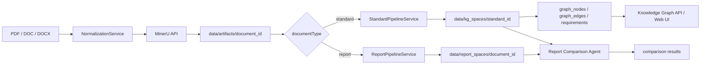

# NormaGraph

NormaGraph 是一个面向水库大坝安全评价场景的规范知识图谱与报告对比原型系统。它把规范、报告等 PDF / DOC / DOCX 文档解析为结构化 artifact，再派生出规范图谱、报告章节单元和报告-规范对比结果，并通过 FastAPI + React Web UI 以单服务形态运行。

## 当前架构

项目采用“前后端分离开发、单服务部署”的结构：

- 后端：FastAPI，入口位于 `src/main.py`
- 前端源码：React + Vite + Tailwind CSS，位于 `frontend/`
- 前端构建产物：输出到 `webui/`，由 FastAPI 挂载到 `/webui`
- API：集中在 `src/api/routes.py`
- 数据产物：默认写入 `data/`
- 配置：运行参数在 `config.yaml`，密钥从 `.env` 读取



## 代码分层

- `src/main.py`：应用装配、依赖初始化、Web UI 静态资源挂载
- `src/api/routes.py`：HTTP 路由、请求参数解析、错误映射
- `src/core/config.py`：`.env + config.yaml` 加载、运行目录解析
- `src/core/logging.py`：日志配置
- `src/adapters/mineru_client.py`：MinerU 在线解析 API 适配
- `src/adapters/llm_client.py`：OpenAI 兼容 `responses` / `embeddings` 客户端
- `src/models/schemas.py`：FastAPI / Pydantic 数据模型
- `src/repositories/job_store.py`：任务状态 JSON 存储
- `src/repositories/standard_registry.py`：标准注册表
- `src/repositories/postgres_graph_store.py`：PostgreSQL / pgvector 可选落库
- `src/services/ingestion_service.py`：任务调度、上传、重试、删除、artifact 归档、图谱与报告空间查询
- `src/services/normalization.py`：输入文档标准化与本地预处理入口
- `src/services/standard_pipeline.py`：规范结构恢复、条文切分、requirements 抽取、图谱物化编排
- `src/services/report_pipeline.py`：报告结构规划、章节与 report unit 切分
- `src/services/report_comparison_agent.py`：报告单元到规范条款的路由、发现、覆盖/违反判断
- `src/services/graph_materialization.py`：节点、边、embedding 输入物化
- `src/resources/schemas/`：LLM 结构化输出 JSON Schema
- `scripts/`：前台调试、离线建图、PostgreSQL 初始化等脚本
- `tests/`：标准流水线、报告流水线、报告对比与 LLM 兼容性测试
- `viewer/`：旧版静态图谱查看器
- `docs/`：架构与策略说明

## 当前能力

已实现：

- 支持 PDF / DOC / DOCX 上传或本地路径 ingestion
- 对接 MinerU 在线 API，归档解析产物
- 标准文档流水线：`content_list_v2.json -> 标题规划 -> 结构恢复 -> 条文切分 -> requirements 抽取 -> 图谱物化`
- 报告文档流水线：LLM 标题规划、报告 section 与 report unit 切分、报告空间落盘
- LLM 抽取支持 `heuristic / llm / hybrid` 模式，以及失败回退
- 支持 chapter summary、report section summary 等辅助摘要
- 支持 embedding 本地 JSONL 输出，可选 PostgreSQL / pgvector 落库
- 支持 Documents、Report、Knowledge Graph、Retrieval、API 五个 Web UI 工作区
- 支持图谱空间切换、节点搜索、局部子图、节点/关系编辑
- 支持报告单元与规范图谱的比较，以及报告级比较任务文件落盘

仍为占位或未完整产品化：

- `POST /v1/qa/ask` 尚未实现，会返回 `501`
- 旧版 `/v1/comparisons/*` 仍是预留接口，会返回 `501`
- Retrieval 页面主要是参数与工作台占位，尚未接入正式问答检索链路
- PostgreSQL / pgvector 仍是可选持久化路径，主读取链路以本地 JSON artifact 为主

## 数据目录

默认存储布局如下：

- `data/jobs/`：ingestion 任务状态
- `data/uploads/`：Web UI 上传的原始文件
- `data/downloads/`：MinerU 下载结果临时工作目录
- `data/artifacts/<document_id>/`：MinerU 与解析中间产物
- `data/kg_spaces/<standard_id>/`：规范知识图谱空间
- `data/report_spaces/<document_id>/`：报告切分、报告单元和对比结果
- `data/registry/standards.json`：标准注册表

典型规范图谱输出：

- `space_manifest.json`
- `normalized_blocks.json`
- `normalized_structure.json`
- `clauses.json`
- `requirements.json`
- `graph_nodes.json`
- `graph_edges.json`
- `embedding_inputs.jsonl`
- `embedding_store.jsonl`
- `segmentation_metrics.json`
- `segmentation_report.md`

典型报告空间输出：

- `space_manifest.json`
- `sections.json`
- `report_units.json`
- `report_nodes.json`
- `report_edges.json`
- `tables.json`
- `figures.json`
- `segmentation_metrics.json`
- `comparisons/<standard_id>.json`

## 安装

Python 依赖：

```powershell
uv pip install --python .\.venv\Scripts\python.exe -e .
```

前端依赖：

```powershell
Set-Location frontend
npm install
Set-Location ..
```

## 配置

密钥放在 `.env`：

```dotenv
MINERU_API_KEY=...
LLM_API_KEY=...
EMBED_API_KEY=...
POSTGRES_PASSWORD=...
```

运行参数放在 `config.yaml`，主要配置域包括：

- `server`
- `storage`
- `mineru`
- `normalization`
- `knowledge_graph`
- `llm`
- `embedding`
- `postgres`

重要开关：

- `knowledge_graph.extraction_mode`：`heuristic / llm / hybrid`
- `knowledge_graph.fallback_to_heuristic_on_llm_error`：LLM 失败时是否回退规则抽取
- `knowledge_graph.materialize_graph`：是否输出图谱节点与边
- `llm.enabled`：是否启用 LLM 标题规划、抽取与报告对比能力
- `embedding.enabled`：是否生成 embedding
- `postgres.enabled`：是否写入 PostgreSQL / pgvector

当前示例配置使用 DashScope OpenAI 兼容接口：

- LLM：`qwen3.6-plus`
- Embedding：`text-embedding-v4`

## 前端构建

```powershell
Set-Location frontend
npm run build
Set-Location ..
```

构建产物会写入 `webui/`。如果只改后端，可以复用已有 `webui/`。

## 启动服务

安装 editable package 后可直接运行：

```powershell
normagraph-server
```

也可以显式调用虚拟环境内的入口：

```powershell
.\.venv\Scripts\normagraph-server.exe
```

默认地址：

- Web UI: `http://127.0.0.1:8010/webui/`
- 根路径: `http://127.0.0.1:8010/`
- Swagger: `http://127.0.0.1:8010/docs`
- OpenAPI JSON: `http://127.0.0.1:8010/openapi.json`
- 健康检查: `http://127.0.0.1:8010/healthz`

## 常用脚本

从原始文件跑完整标准建图链路：

```powershell
.\.venv\Scripts\python.exe scripts\test_ingestion_pipeline.py `
  --source-path "Doc/1_SL 258-2017 水库大坝安全评价导则.pdf" `
  --document-type standard `
  --standard-id sl258:2017
```

只跑 MinerU 解析，不建图：

```powershell
.\.venv\Scripts\python.exe scripts\test_ingestion_pipeline.py `
  --source-path "Doc/1_SL 258-2017 水库大坝安全评价导则.pdf" `
  --document-type standard `
  --no-build-graph
```

对已有 artifact 离线重建规范图谱：

```powershell
.\.venv\Scripts\python.exe scripts\run_standard_pipeline.py `
  --artifact-dir data\artifacts\<document_id> `
  --standard-id sl258:2017
```

生成1-hop和2-hop的QA：

```powershell
python scripts\generate_1hop_qa.py --question-count 200 --candidate-count 300
python scripts\generate_2hop_qa.py --append --question-count 120 --candidate-count 300 --seed 20260618             
```

全量评估QA：
```
python .\scripts\evaluate_rag_qa.py --top-k 8 --chunk-top-k 10 --retrieval-workers 4 --judge-workers 4 --output data/eval/rag-eval-report.json
```

初始化 PostgreSQL / pgvector：

```powershell
.\.venv\Scripts\python.exe scripts\ensure_postgres_db.py
```

## 主要 API

基础：

- `GET /healthz`
- `GET /health`

任务与文档：

- `POST /v1/ingestions`
- `GET /v1/ingestions/{job_id}`
- `GET /v1/documents`
- `GET /v1/documents/{document_id}/jobs`
- `POST /v1/documents/upload`
- `POST /v1/documents/{document_id}/retry`
- `DELETE /v1/documents/{document_id}`

标准与图谱：

- `GET /v1/standards`
- `GET /v1/standards/{standard_id}`
- `GET /v1/standards/{standard_id}/subgraph`
- `GET /v1/kg-spaces`
- `GET /v1/kg-spaces/{standard_id}`
- `GET /v1/kg-spaces/{standard_id}/search`
- `GET /v1/kg-spaces/{standard_id}/subgraph`
- `PATCH /v1/kg-spaces/{standard_id}/nodes/{node_id}`
- `PATCH /v1/kg-spaces/{standard_id}/edges/{edge_id}`
- `GET /v1/requirements/{requirement_id}`

工作台图谱接口：

- `GET /graphs` / `GET /v1/graphs`
- `GET /graph/label/popular` / `GET /v1/graph/label/popular`
- `GET /graph/label/search` / `GET /v1/graph/label/search`
- `GET /graph/entity/exists` / `GET /v1/graph/entity/exists`
- `POST /graph/entity/edit` / `POST /v1/graph/entity/edit`
- `POST /graph/relation/edit` / `POST /v1/graph/relation/edit`

报告空间与报告对比：

- `GET /v1/report-spaces/{document_id}`
- `POST /v1/report-spaces/{document_id}/comparisons`
- `GET /v1/report-spaces/{document_id}/comparisons/{standard_id}`
- `POST /v1/report-spaces/{document_id}/units/{unit_uid}/compare`

仍为占位：

- `POST /v1/qa/ask`
- `POST /v1/comparisons`
- `GET /v1/comparisons/{comparison_id}`
- `GET /v1/comparisons/{comparison_id}/items`

## 测试

```powershell
.\.venv\Scripts\python.exe -m pytest
```

当前测试覆盖重点包括：

- 标准文档标题规划、章节摘要、表格归属和 requirement 切分
- LLM 抽取失败信息与返回 shape 兼容
- 报告标题规划、report unit 切分
- 报告对比路由、失败 fallback、并发、IO 原子写入和 clause 聚合

## 已知边界

- MinerU 当前在线 API 处理能力受其服务限制影响，长文档和网络上传阶段可能失败。
- 当前业务约束中，MinerU 处理文本建议小于 200 页。
- OpenAI 兼容端点对 `/responses` 与结构化输出的兼容程度不一，可能出现超时、返回 shape 漂移或解析失败。
- `fallback_to_heuristic_on_llm_error=true` 可以保证标准建图链路尽量闭环，但质量不等价于稳定 LLM 抽取。
- 报告对比依赖规范图谱、报告空间和 LLM 路由质量；存在 failed units 时，coverage 不应视为最终结论。
- 当 `embedding.enabled=true` 或 `postgres.enabled=true` 时，需要确保对应服务、密钥和权限可用。

- （日志后续要更新为中文，加进度显示）
- （报告对规范图谱的覆盖率计算）
- （图rag）
- 移除“本地默认值计算最终 requirements.json 里的内部置信度”