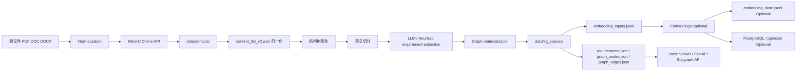

# 规范知识图谱与智能体架构设计

## 1. 当前实现状态

截至当前仓库版本，项目已经从资料仓演进为一个可运行的最小系统，核心目标是把规范文档转换为可检索、可展示、可扩展的知识图谱底座，并为后续 QA / 对比能力预留接口和数据结构。

已完成的能力：

- 已有 FastAPI 服务骨架，可提交 ingestion 任务并查询任务状态。
- 已有 MinerU 在线 API 适配层，支持 PDF / DOC / DOCX 输入。
- 已有文档标准化层，保留 `localhost` 场景下 `.doc -> pdf` 本地预处理入口。
- 已有 `content_list_v2.json -> 结构归一化 -> 条文切分 -> requirement extraction` 主流水线。
- 已有 LLM 抽取链路，统一走 OpenAI 兼容的 `responses` 风格接口。
- 已有结构化输出兼容层，可兼容 `items / results / clauses / extracted_requirements` 等返回形状。
- 已有 batch 级重试、退避与并发控制，并保证最终结果按原始条文顺序归并。
- 已有图谱物化输出：`requirements.json`、`graph_nodes.json`、`graph_edges.json`、`embedding_inputs.jsonl`、`embedding_store.jsonl`。
- 已有 embedding 生成链路，受配置控制；当 PostgreSQL 关闭时会额外保留本地 JSONL 向量快照。
- 已有 PostgreSQL / pgvector 持久化原型，受配置控制，当前默认关闭。
- 当 PostgreSQL 开启时，若目标数据库不存在，首次落库会自动完成建库和基础 schema 初始化。
- 已有面向前端读取的接口：标准列表、标准详情、子图查询、requirement 明细查询。
- 已有不依赖后端 API 的静态图谱前端，可直接加载标准图谱空间目录展示节点详情和局部关系。
- 已有前台调试脚本，可直接观察标准化、上传、轮询、抽取、建图和输出文件路径。

当前尚未完成的能力：

- QA Agent 还未实现。
- 报告对比 Agent 还未实现。
- 报告证据块切分与规范要求对齐还未实现。
- 多规范自动路由和跨图扩展检索还未实现。
- PostgreSQL / pgvector 目前仍是可选原型，尚未形成正式检索层。

## 2. 当前代码结构

当前代码以扁平 `src/` 结构组织，已形成较清晰的分层：

- `src/main.py`
  - FastAPI 应用入口
- `src/api/routes.py`
  - HTTP 路由
- `src/core/config.py`
  - `.env + config.yaml` 配置加载与运行时资源路径管理
- `src/core/logging.py`
  - 日志配置
- `src/adapters/mineru_client.py`
  - MinerU 在线 API
- `src/adapters/llm_client.py`
  - OpenAI 兼容 `responses` / `embeddings` 客户端
- `src/services/normalization.py`
  - 文档标准化与本地预处理识别
- `src/services/ingestion_service.py`
  - ingestion 任务调度、artifact 归档、标准注册表更新
- `src/services/standard_pipeline.py`
  - 结构恢复、条文切分、requirement 抽取、embedding 与落库 orchestration
- `src/services/llm_extraction.py`
  - 批量 LLM 抽取、返回形状兼容、重试与并发控制
- `src/services/graph_materialization.py`
  - 图节点、图边和 embedding 文档物化
- `src/repositories/job_store.py`
  - 任务状态存储
- `src/repositories/standard_registry.py`
  - 标准注册表
- `src/repositories/postgres_graph_store.py`
  - PostgreSQL / pgvector 落库
- `src/models/schemas.py`
  - API 数据模型
- `src/resources/schemas/`
  - 运行时 JSON Schema 资源
- `viewer/`
  - 独立静态图谱前端
- `scripts/test_ingestion_pipeline.py`
  - 从源文件开始的前台调试脚本
- `scripts/run_standard_pipeline.py`
  - 针对已有 artifact 的离线建图脚本
- `scripts/serve_graph_viewer.py`
  - 独立静态 viewer 启动脚本

## 3. 当前主链路

当前已经实现的最小闭环如下：

说明：

- `MinerU` 负责版面理解和中间结果生成。
- 结构树恢复不依赖 Markdown `#` 层级，而是优先依赖编号语义与 `content_list_v2.json` 块结构。
- requirement extraction 支持三种模式：`heuristic`、`llm`、`hybrid`。
- 当前推荐运行策略是 `llm + fallback_to_heuristic_on_llm_error=true`。
- 图谱既可以通过 API 读取，也可以直接由静态 viewer 从标准 graph space JSON 文件读取。

## 3.1 当前存储布局

当前实现已经把“文档解析产物”和“标准图谱空间”拆成两层目录：

- `data/artifacts/<document_id>/`
  - 保留 MinerU 解析结果、`content_list_v2.json`、`full.md`、版面图片等文档级 artifact
- `data/kg_spaces/<standard_id>/`
  - 保留 `requirements.json`、`graph_nodes.json`、`graph_edges.json`、`embedding_inputs.jsonl`、`embedding_store.jsonl`、metrics 等标准图谱空间产物

这样做的目的有两个：

- 规范、报告等不同文档类型都可以复用统一的 artifact 落盘约定
- 每个标准维护一个当前生效的 graph space，便于后续接入报告对比和多规范路由；如果未来需要版本快照，再在标准目录下增加 revisions 层会更清晰

## 4. 文档处理与标准化设计现状

### 4.1 已落地策略

- 当前只优先支持 MinerU 在线 API。
- 上层统一通过 parser provider / endpoint 发起解析。
- `.doc / .docx` 输入可进入标准化层，再送入 MinerU。
- 若 endpoint 命中 `localhost / 127.0.0.1`，标准化层会识别为本地预处理场景。
- `.doc -> pdf` 本地转换链路仍是预留能力，需要在 `config.yaml` 中显式配置命令才启用。

### 4.2 当前运行边界

- MinerU 批任务创建成功后，仍可能在 OSS 上传阶段受网络环境影响。
- OpenAI 兼容端点未必完整支持 `/responses`，可能出现超时或结构化输出不稳定。
- 当前运行策略是：
  - MinerU 上传 / 轮询失败时直接报错
  - LLM 抽取失败时尽量重试
  - 若仍失败且配置允许，则回退到启发式抽取

## 5. 结构归一化与条文切分现状

当前实现已经覆盖的问题：

- `full.md` 中多个标题都被解析成一级 `#` 的情况
- 章节、节、条的层级恢复
- 列表项继承父条文主语或模态词的情况
- 附录条文保留但默认不参与 requirement extraction
- 条文连续块、孤儿块、重复编号等统计信息输出

当前设计原则：

- 保留完整父条文
- requirement 是条文的结构化派生，而不是替换条文
- 每条 requirement 保留其父条文和来源位置信息

当前 requirement 输出中已包含的核心字段：

- `standard_uid`
- `clause_ref`
- `parent_clause_uid`
- `source_text`
- `source_page_span`
- `source_bbox`
- `modality`
- `subject`
- `action`
- `object`
- `applicability_rule`
- `judgement_criteria`
- `evidence_expected`
- `domain_tags`
- `cited_targets`
- `confidence`

## 6. 当前 LLM 抽取层设计

### 6.1 已落地能力

`src/services/llm_extraction.py` 目前已经支持：

- 以 batch 为单位调用结构化抽取
- 读取运行时 schema：`src/resources/schemas/clause_graph_extraction.schema.json`
- 兼容多个返回 key：
  - `items`
  - `results`
  - `clauses`
  - `extracted_requirements`
- 对 list / object / nested `data.*` 返回形状做归一化
- 对 requirement 内部字段做字符串、数组、引用目标等归一化
- `batch_max_retries` 控制重试次数
- `batch_retry_backoff_seconds` 控制退避时间
- `batch_max_concurrency` 控制并发数
- embedding 侧也已补上独立的 `max_retries` / `retry_backoff_seconds`，用于应对连接超时、429 和 5xx
- 最终对 batch 结果按 `batch_index` 排序，避免并发破坏原始处理顺序

### 6.2 当前度量输出

当前会输出这些 LLM 相关指标：

- `llm_requested_clause_count`
- `llm_failed_clause_count`
- `llm_batch_count`
- `llm_retried_batch_count`
- `llm_retry_attempt_count`
- `llm_failed_batch_count`
- `llm_batch_max_concurrency`
- `extraction_mode_effective`

### 6.3 当前风险点

- 某些兼容端点虽然返回 `200`，但 structured output shape 仍可能漂移。
- 兼容层已经尽量兜底，但并不能替代真正稳定的服务端 schema 支持。
- 启发式回退能保证闭环不断，但质量上仍不等价于稳定的 LLM 结构化抽取。

## 7. 当前图谱模型

### 7.1 已落地节点类型

当前物化阶段已实际写出这些节点：

- `standard`
- `chapter`
- `section`
- `appendix`
- `clause`
- `requirement`
- `concept`
- `reference_standard`

### 7.2 已落地边类型

当前物化阶段已实际写出这些边：

- `CONTAINS`
- `NEXT`
- `DERIVES_REQUIREMENT`
- `ABOUT`
- `CITES_STANDARD`

### 7.3 当前尚未物化的关系

以下关系仍停留在架构设计阶段：

- `CITES_CLAUSE`
- `REQUIRES_EVIDENCE`
- `APPLIES_TO`
- `SUPPORTED_BY`
- `PARTIALLY_SUPPORTS`
- `CONFLICTS_WITH`

## 8. 当前接口状态

### 8.1 已实现接口

- `GET /healthz`
- `POST /v1/ingestions`
- `GET /v1/ingestions/{jobId}`
- `GET /v1/standards`
- `GET /v1/standards/{standardId}`
- `GET /v1/standards/{standardId}/subgraph`
- `GET /v1/requirements/{requirementId}`

其中：

- `subgraph` 接口当前优先从 registry 中记录的 `graphSpaceDir` 读取 `graph_nodes.json / graph_edges.json`
- `requirement` 详情接口当前优先从 registry 中记录的 `graphSpaceDir` 读取 `requirements.json`
- API 读取层当前以标准 graph space 物化文件为主，而非数据库优先

### 8.2 预留未实现接口

- `POST /v1/qa/ask`
- `POST /v1/comparisons`
- `GET /v1/comparisons/{comparisonId}`
- `GET /v1/comparisons/{comparisonId}/items`

这些接口当前会显式返回 `501 Not Implemented`。

## 9. 当前 viewer 形态

当前仓库已经补上一个与后端解耦的静态图谱前端：

- 默认直接消费标准 graph space 中的 JSON 文件
- 不依赖 FastAPI API
- 支持通过 `scripts/serve_graph_viewer.py` 直接预加载某个 graph space；传入 artifact 目录时会尝试通过 registry 解析到对应 space
- 支持在页面中直接选择 `data/kg_spaces/<standard_id>` 自动加载
- 支持节点详情、结构化属性、关联 requirement、相邻节点展示
- 图谱区域当前采用局部邻域渲染，避免一次性加载全图造成浏览器压力

这意味着当前项目已经具备“生成图谱 + 独立展示图谱”的完整演示链路。

## 10. 配置体系现状

当前项目采用双层配置：

- 密钥放在 `.env`
- 运行参数放在 `config.yaml`

当前已接入的配置域：

- `server`
- `storage`
- `mineru`
- `normalization`
- `knowledge_graph`
- `llm`
- `embedding`
- `postgres`

当前默认代码结构支持 OpenAI 兼容接口；当前示例配置已接入 DashScope 兼容端点：

- LLM: `qwen3.5-plus`
- Embedding: `text-embedding-v4`

## 11. 当前测试与运维方式

### 11.1 后台 API 模式

适合模拟前后端联调：

1. 启动 API
2. `POST /v1/ingestions`
3. 轮询 `GET /v1/ingestions/{jobId}`

### 11.2 前台脚本模式

适合定位问题与查看完整日志：

- `scripts/test_ingestion_pipeline.py`

该脚本会输出：

- 标准化阶段
- MinerU 上传 URL
- OSS 上传阶段
- 结果轮询阶段
- 图谱构建阶段
- 抽取 warnings
- graph metrics
- 最终输出文件路径

### 11.3 离线建图模式

适合已有 MinerU artifact 的纯建图验证：

- `scripts/run_standard_pipeline.py`
  - 从 parse artifact 重建 graph space

### 11.4 图谱展示模式

适合验收图谱结构和节点详情：

- `scripts/serve_graph_viewer.py`
- `viewer/index.html`

## 12. 当前最重要的已知风险

1. MinerU OSS 上传网络风险
   - 任务可能已创建成功，但文件上传失败，导致解析未真正开始。
2. OpenAI 兼容端点的 `/responses` 兼容性风险
   - 某些兼容服务可能超时、返回格式不兼容，或只部分兼容 structured output。
3. embedding 服务稳定性风险
   - 当启用 embedding 但服务未就绪时，流水线会在向量生成阶段失败。
4. PostgreSQL / pgvector 连接风险
   - 当配置启用但 PostgreSQL 服务不可达、凭据错误或账号权限不足时，流水线会在落库阶段受影响；若仅数据库不存在，当前实现会自动创建。
5. requirement extraction 质量风险
   - 启发式链路能兜底，但不能替代稳定的 LLM 结构化抽取。
6. comparison / QA 尚未落地
   - 当前底座已具备，但还不能直接给出覆盖性判断或问答结果。

## 13. 下一阶段建议

按当前代码状态，建议优先级如下：

1. 继续稳定 LLM 端点和 structured output
   - 降低 shape 漂移和 fallback 比例
2. 完成 evidence 级结构扩展
   - 为后续报告对比准备证据关系
3. 完成报告证据块切分
   - 把报告内容映射成可对照节点
4. 完成 comparison 工作流
   - 输出 `covered / partial / missing / unknown`
5. 完成 QA / 检索层
   - 将 `graph + embedding + artifact` 真正接到问答链路
6. 评估数据库优先读取模式
   - 从当前本地文件读取逐步过渡到更正式的检索层

## 14. 当前结论

当前仓库已经不是纯架构草案，而是一个具备以下实际能力的最小系统：

- 文档入口
- 解析中间层
- 结构归一化
- 条文切分
- requirement extraction
- 图谱物化
- embedding 准备
- 可选落库
- API 读取
- 静态图谱展示
- 前台日志调试

也就是说，规范知识图谱的底座已经初步搭好。下一阶段工作的重点不再是从零设计，而是把 LLM 抽取稳定性、报告对比和 QA 真正补齐。
